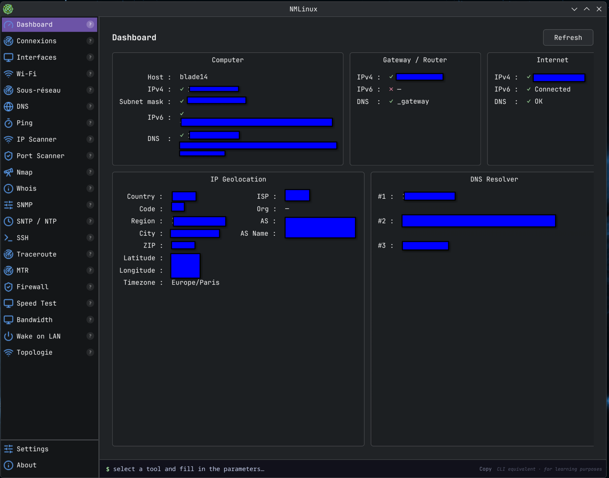
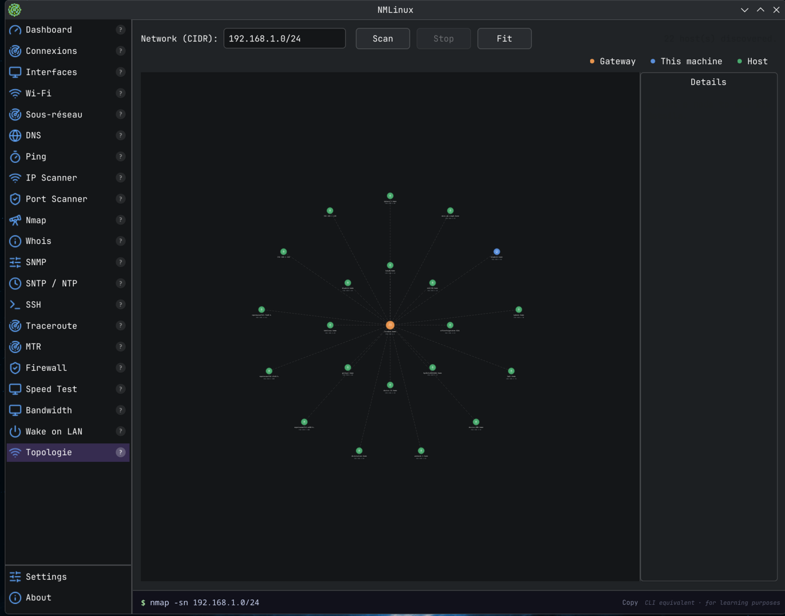
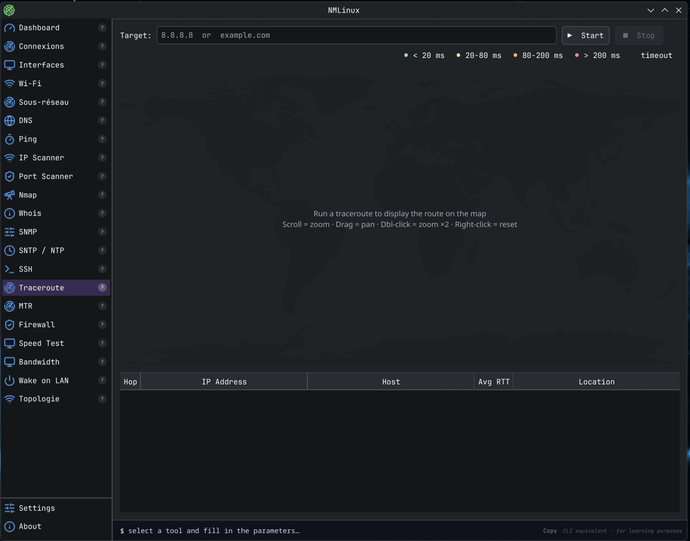
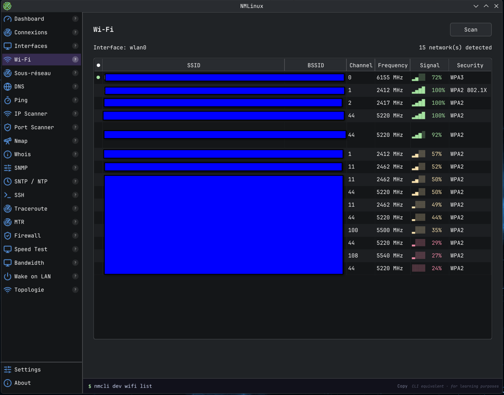

# NMLinux · v1.2.8

[](https://www.paypal.com/donate/?business=JFQGY7NU3ANCN&no_recurring=0&item_name=Every+donation%2C+no+matter+how+small%2C+helps+me+keep+this+project+alive.+Thank+you%21%0A&currency_code=EUR)

**A free Linux adaptation of [NETworkManager](https://github.com/BornToBeRoot/NETworkManager) by BornToBeRoot.**

NMLinux brings the spirit of NETworkManager to Linux desktops, reimplemented from scratch in Python and PySide6 (Qt 6). It is not a port of the original C# code, but an independent project inspired by the same idea: a single, unified GUI for the most common network tools a sysadmin or power user needs.

> [!NOTE]
> **NMLinux is not related to the Linux system daemon `/usr/bin/NetworkManager` (NetworkManager by Red Hat/GNOME).** The name comes from [NETworkManager](https://github.com/BornToBeRoot/NETworkManager) by BornToBeRoot, a similar tool for Windows that served as the original inspiration.

> Built with [Claude Code](https://claude.ai/code) (Anthropic) and the contribution of its author.

---

## Screenshots

| Dashboard | Topology |
|-----------|----------|
|  |  |

| Traceroute | Wi-Fi |
|------------|-------|
|  |  |

---

## Changelog

### v1.2.8 — 2026-05-30

- **Remote Desktop (RDP)** — new module for managing Windows RDP connection profiles; groups/subgroups like SSH; launches `xfreerdp` as an external process; password prompted at connect time, never stored; fields: host, port, username, domain, resolution, fullscreen; detects missing `xfreerdp` with distro-specific install instructions (Arch / Debian / Fedora)

### v1.2.7 — 2026-05-26

- **Bundled Lucide icons** — 21 SVG icons from [Lucide](https://lucide.dev) (MIT) are now bundled in `assets/icons/`; rendered at runtime via `QSvgRenderer`; coloured `#60a5fa`; app no longer requires any system icon theme (Breeze, Adwaita, Papirus…)

### v1.2.6 — 2026-05-24

- **GNOME / Adwaita compatibility** — fixed icons on non-KDE desktops: `main.py` now auto-detects the GTK icon theme via `gsettings` and applies it to Qt; extended fallback chains for Wi-Fi, Traceroute, Speed Test, Interfaces, Port Scanner, Firewall, MTR; `themed_icon()` now validates that a real pixmap exists before accepting a theme icon
- **NixOS / KDE compatibility** — fixed all icons on NixOS: Breeze 6.x ships SVGZ-only icons; the Nix wrapper now adds `qt6.qtsvg` to `QT_PLUGIN_PATH` so Qt can render SVG icons; `themed_icon()` tries sizes 22/24/16/32/48 (Breeze uses 22 px, not 24); theme forced to `breeze` when the Nix-bundled icon set is detected; also checks `/etc/xdg/kdeglobals` for system-wide KDE config

### v1.2.5 — 2026-05-23

- **MTR** — embedded My Traceroute: runs `mtr --report`, parses text output, displays a live table with Loss %, RTT Last/Avg/Best/Worst/Jitter per hop, colour-coded by loss severity; continuous mode; CSV + TXT export
- **Speed Test** — dependency-free speed test via `curl` + Cloudflare (`speed.cloudflare.com`): download (25 MB), upload (10 MB), ping to `1.1.1.1`; up to 5 runs persisted in JSON; historical line graph (Download/Upload)
- **Firewall Viewer** — read-only ruleset viewer: parses `/etc/nftables.conf` and `/etc/iptables/*.rules` without root; live ruleset via `pkexec nft list ruleset`; columns: Table / Chain / Rule / Port / Action / Comment; colour-coded actions; live filter
- **Sidebar hints** — each nav entry now shows a subtle `?` badge; hovering displays a tooltip describing what the module does; vertical separator added between sidebar and content area
- **i18n** — all new modules translated in French, English, and Spanish

### v1.2.0 — 2026-05-22

- **Theme adaptation** — full runtime light/dark switching support across all pages; new `core/theme.py` with `is_dark()`, `color_ok()`, `color_err()`; custom painter widgets (`_Graph`, `_MapWidget`) read palette at paint time; all hardcoded Catppuccin Mocha colours replaced with semantic Qt palette roles
- **Subnet mask** — Dashboard, Interfaces, and Connexions pages now display dotted-decimal subnet mask (e.g. `255.255.255.0`) derived from CIDR prefix
- **Bandwidth Monitor** — explicit Start/Stop button replaces unreliable auto-start on page load
- **Export CSV/TXT** — Nmap and Traceroute pages now offer Export CSV and Export TXT buttons (appear after scan/trace completes)
- **i18n** — new translation keys for all above features (fr/en/es/de)

### v1.1.1 — 2026-05-16

- **SSH terminal** — complete rewrite with [pyte](https://github.com/selectel/pyte) (VT100/xterm emulator) + QPainter renderer; 2000-line scrollback, cursor blink, 256-colour support
- **Visual Traceroute** — world map (Natural Earth 110m), live geolocation per hop (ip-api.com), interactive zoom/pan, dual parser (`traceroute` / `tracepath` fallback)
- **Bandwidth Monitor** — real-time per-interface throughput, 60s sliding graph, live speeds, session totals and peaks
- **Wake on LAN** — pure Python magic packet (UDP broadcast), persistent host book (JSON)
- **IP Scanner** — hostname resolution via `getent`/`avahi`/`nmblookup`; MAC address, vendor (IEEE OUI 39K entries), interface columns; CSV/TXT export updated
- **i18n** — full fr/en/es/de translation for all new pages

### v1.0.0 — 2026-05-14

Initial public release — 13 modules: Dashboard, Interfaces, Wi-Fi, Subnet Calculator, DNS Lookup, Ping Monitor, IP Scanner, Port Scanner, Nmap, Whois, SNMP, SNTP/NTP, SSH.

---

## Features

| Module | Description |
|--------|-------------|
| **Dashboard** | Local machine info, gateway, public IP, geolocation, DNS resolvers |
| **Interfaces** | Network interfaces table with per-interface detail (`ip` + `nmcli`) |
| **Wi-Fi** | Available networks, signal bars, security, connected network highlighted |
| **Subnet Calculator** | Network/broadcast/host range from CIDR, host table up to 4096 entries |
| **DNS Lookup** | `dig`-based lookup for A, AAAA, MX, TXT, NS, CNAME, PTR, SOA, ANY |
| **Ping Monitor** | Continuous ping to multiple hosts, RTT stats, packet loss % |
| **IP Scanner** | CIDR/range ping scan, 50 threads, hostname (DNS/mDNS/NetBIOS), MAC address, vendor (OUI), interface, CSV + TXT export |
| **Port Scanner** | TCP connect scan, 200 threads, service presets, CSV + TXT export |
| **Nmap** | 7 scan modes, XML output parsing, Host/Port/Protocol/State/Service table, CSV + TXT export |
| **Whois** | Raw whois output in monospace |
| **SNMP** | `snmpwalk`/`snmpget`, v1/v2c, 10 OID presets, results table |
| **SNTP / NTP** | Pure Python RFC 4330 UDP client, offset/delay/stratum/reference |
| **SSH** | Embedded PTY terminal (pyte/VT100), saved connections (JSON), key auth, scrollback |
| **Visual Traceroute** | Hop-by-hop route on a world map, live geolocation (ip-api.com), zoom & pan, CSV + TXT export |
| **MTR** | Embedded My Traceroute: loss %, RTT Last/Avg/Best/Worst/Jitter per hop, colour-coded, CSV + TXT export |
| **Firewall Viewer** | Read-only nftables + iptables/ip6tables ruleset (no root); live via pkexec; filter by table/chain/action |
| **Speed Test** | Download/upload/ping via Cloudflare; no external tool beyond `curl`; history graph (last 5 runs) |
| **Bandwidth** | Real-time per-interface throughput: 60s sliding graph, live speeds, session totals, peak |
| **Wake on LAN** | Pure Python magic packet (UDP broadcast), persistent host book, no external tool required |
| **Settings** | Language selection (French, English, Spanish, German), persisted |

---

## Requirements

### System tools

Most are already present on a standard Linux install:

```bash
# Debian / Ubuntu
sudo apt install iproute2 network-manager dnsutils nmap whois snmp mtr-tiny curl

# Arch / EndeavourOS
sudo pacman -S iproute2 networkmanager bind-tools nmap whois net-snmp iputils mtr curl

# Fedora
sudo dnf install iproute NetworkManager bind-utils nmap whois net-snmp-utils mtr curl
```

### Python

- Python 3.11+
- PySide6 6.6+
- ptyprocess 0.7+
- pyte 0.8+ (`pip install pyte` or `sudo pacman -S python-pyte`)

---

## Installation

### Option 1 — Arch Linux / Manjaro / EndeavourOS (AUR)

```bash
yay -S nmlinux
```

All dependencies (PySide6, ptyprocess, pyte, nmcli, …) are handled automatically.

### Option 2 — Wheel (all distros)

Download the `.whl` from the [latest release](https://github.com/thongor77/nmlinux/releases/latest) and install it:

```bash
pip install nmlinux-1.2.7-py3-none-any.whl
nmlinux
```

### Option 3 — From source

```bash
git clone https://github.com/thongor77/nmlinux.git
cd nmlinux
pip install PySide6 ptyprocess pyte
python3 -m nmlinux.main
```

### Option 4 — Desktop entry (KDE / GNOME / etc.)

Copy the `.desktop` file to make NMLinux appear in your application launcher:

```bash
cp data/nmlinux.desktop ~/.local/share/applications/
update-desktop-database ~/.local/share/applications/
```

Then edit the `Exec=` path in the file if needed.

---

## Running

```bash
./nmlinux.sh
# or, after pip install:
nmlinux
# or directly:
python3 -m nmlinux.main
```

---

## Project structure

```
nmlinux/
  core/
    i18n.py         — Translation system (fr/en/es/de), tr(key) function
    icons.py        — themed_icon() with cross-desktop fallback chains
    settings.py     — AppSettings dataclass, JSON persistence
    ssh.py          — SshConnection dataclass, SshStore
    terminal.py     — SshWorker (QThread) + PTY via ptyprocess, emits raw bytes
  pages/
    about.py        — About page (credits, links)
    dashboard.py    — Dashboard
    dns.py          — DNS Lookup
    interfaces.py   — Network Interfaces
    ip_scanner.py   — IP Scanner
    nmap_scan.py    — Nmap
    ping.py         — Ping Monitor
    port_scanner.py — Port Scanner
    settings.py     — Settings page
    snmp.py         — SNMP
    sntp.py         — SNTP / NTP
    ssh.py          — SSH page (connection manager + terminal)
    subnet.py       — Subnet Calculator
    terminal_view.py — TerminalView: pyte VT100 emulator + QPainter renderer
    traceroute.py   — Visual Traceroute: world map, geolocation, zoom/pan
    mtr.py          — MTR: mtr --report parser, live hop stats table, export
    firewall.py     — Firewall Viewer: nftables + iptables parser, live via pkexec
    speedtest.py    — Speed Test: curl + Cloudflare, history graph
    bandwidth.py    — Bandwidth Monitor: per-interface 60s graph, live stats
    wol.py          — Wake on LAN: magic packet, persistent host book
    whois.py        — Whois
    wifi.py         — Wi-Fi
  assets/
    world.geojson   — Natural Earth 110m countries (map background)
  window.py         — MainWindow (sidebar + QStackedWidget)
  main.py           — Entry point
```

---

## Desktop environment compatibility

NMLinux uses `QIcon.fromTheme()` with fallback chains for every icon, so it
displays correctly on KDE (Breeze), GNOME (Adwaita/Yaru), XFCE, and others.
The Qt style adapts to the running desktop automatically.

---

## Limitations

- Linux only (relies on `nmcli`, `ip`, `dig`, `ping`, subprocess tools)
- No root/polkit integration — tools requiring elevated privileges (some Nmap
  modes, raw sockets) must be run manually with `sudo`
- SSH supports password and key-based auth; agent forwarding not yet implemented

---

## Credits and acknowledgements

- **[BornToBeRoot](https://github.com/BornToBeRoot)** — for [NETworkManager](https://github.com/BornToBeRoot/NETworkManager), the original inspiration and reference for features and UX
- **[Anthropic](https://www.anthropic.com)** — Claude Code, the AI assistant used to build this project
- The author, for the vision, testing, and direction

---

## License

GPL-2.0 — see [LICENSE](LICENSE).

This project is an independent reimplementation. No code from NETworkManager was used or translated.
