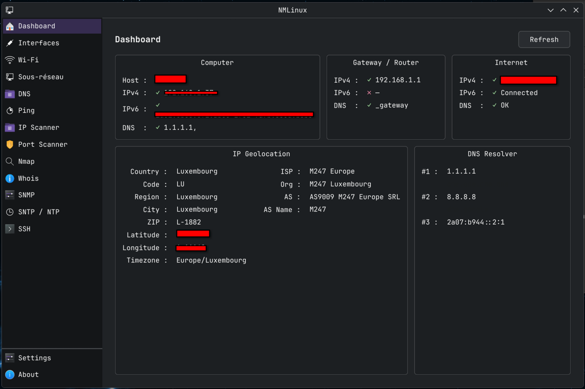
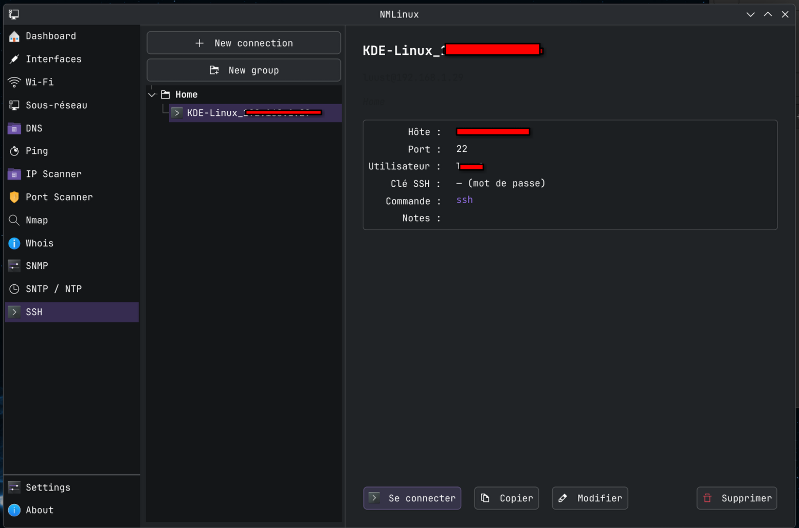
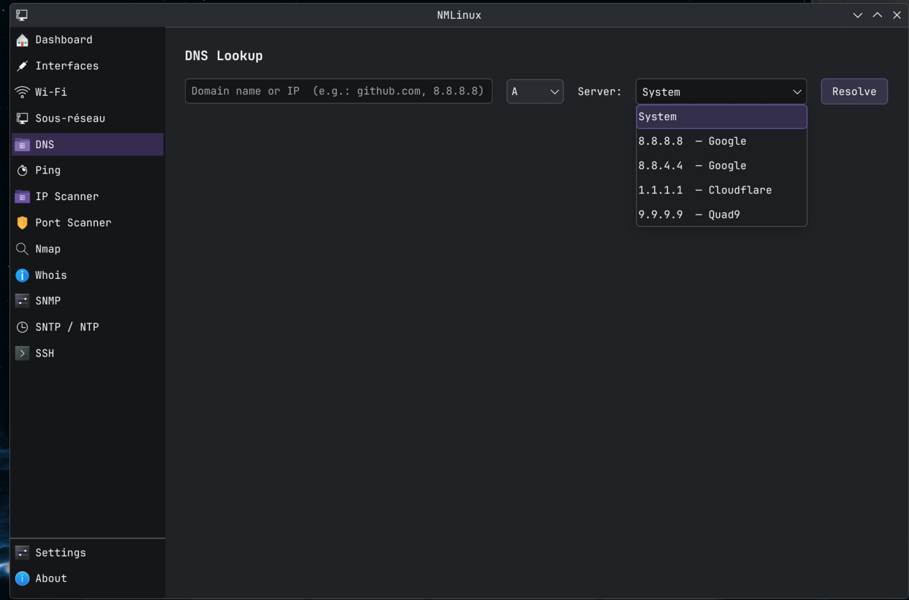

# NMLinux

**A free Linux adaptation of [NETworkManager](https://github.com/BornToBeRoot/NETworkManager) by BornToBeRoot.**

NMLinux brings the spirit of NETworkManager to Linux desktops, reimplemented from scratch in Python and PySide6 (Qt 6). It is not a port of the original C# code, but an independent rewrite inspired by the same idea: a single, unified GUI for the most common network tools a sysadmin or power user needs.

> Built with [Claude Code](https://claude.ai/code) (Anthropic) and the contribution of its author.

---

## Screenshots

| Dashboard | SSH Terminal |
|-----------|-------------|
|  |  |

| DNS Lookup | Port Scanner |
|------------|-------------|
|  |  |

---

## Features

| Module | Description |
|--------|-------------|
| **Dashboard** | Local machine info, gateway, public IP, geolocation, DNS resolvers |
| **Interfaces** | Network interfaces table with per-interface detail (`ip` + `nmcli`) |
| **Wi-Fi** | Available networks, signal bars, security, connected network highlighted |
| **Subnet Calculator** | Network/broadcast/host range from CIDR, host table up to 4096 entries |
| **DNS Lookup** | `dig`-based lookup for A, AAAA, MX, TXT, NS, CNAME, PTR, SOA, ANY |
| **Ping Monitor** | Continuous ping to multiple hosts, RTT stats, packet loss % |
| **IP Scanner** | CIDR/range ping scan, 50 concurrent threads, CSV + TXT export |
| **Port Scanner** | TCP connect scan, 200 threads, service presets, CSV + TXT export |
| **Nmap** | 7 scan modes, XML output parsing, Host/Port/Protocol/State/Service table |
| **Whois** | Raw whois output in monospace |
| **SNMP** | `snmpwalk`/`snmpget`, v1/v2c, 10 OID presets, results table |
| **SNTP / NTP** | Pure Python RFC 4330 UDP client, offset/delay/stratum/reference |
| **SSH** | Embedded PTY terminal, saved connections (JSON), key auth support |
| **Settings** | Language selection (French, English, Spanish, German), persisted |

---

## Requirements

### System tools

Most are already present on a standard Linux install:

```bash
# Debian / Ubuntu
sudo apt install iproute2 network-manager dnsutils nmap whois snmp

# Arch / EndeavourOS
sudo pacman -S iproute2 networkmanager bind-tools nmap whois net-snmp

# Fedora
sudo dnf install iproute NetworkManager bind-utils nmap whois net-snmp-utils
```

### Python

- Python 3.11+
- PySide6 6.6+
- ptyprocess 0.7+

---

## Installation

### Option 1 — pip (recommended)

```bash
pip install PySide6 ptyprocess
git clone <this-repo>
cd nmlinux
./nmlinux.sh
```

### Option 2 — install as a package

```bash
pip install .
nmlinux
```

### Option 3 — Desktop entry (KDE / GNOME / etc.)

Copy the `.desktop` file to make NMLinux appear in your application launcher:

```bash
cp data/nmlinux.desktop ~/.local/share/applications/
update-desktop-database ~/.local/share/applications/
```

Then edit the `Exec=` path in the file if needed.

---

## Running

```bash
./nmlinux.sh
# or, after pip install:
nmlinux
# or directly:
python3 -m nmlinux.main
```

---

## Project structure

```
nmlinux/
  core/
    i18n.py       — Translation system (fr/en/es/de), tr(key) function
    icons.py      — themed_icon() with cross-desktop fallback chains
    settings.py   — AppSettings dataclass, JSON persistence
    ssh.py        — SshConnection dataclass, SshStore
    terminal.py   — SshWorker (QThread) + PTY via ptyprocess
  pages/
    about.py      — About page (credits, links)
    dashboard.py  — Dashboard
    dns.py        — DNS Lookup
    interfaces.py — Network Interfaces
    ip_scanner.py — IP Scanner
    nmap_scan.py  — Nmap
    ping.py       — Ping Monitor
    port_scanner.py — Port Scanner
    settings.py   — Settings page
    snmp.py       — SNMP
    sntp.py       — SNTP / NTP
    ssh.py        — SSH page + embedded terminal
    subnet.py     — Subnet Calculator
    whois.py      — Whois
    wifi.py       — Wi-Fi
  window.py       — MainWindow (sidebar + QStackedWidget)
  main.py         — Entry point
```

---

## Desktop environment compatibility

NMLinux uses `QIcon.fromTheme()` with fallback chains for every icon, so it
displays correctly on KDE (Breeze), GNOME (Adwaita/Yaru), XFCE, and others.
The Qt style adapts to the running desktop automatically.

---

## Limitations

- Linux only (relies on `nmcli`, `ip`, `dig`, `ping`, subprocess tools)
- No root/polkit integration — tools requiring elevated privileges (some Nmap
  modes, raw sockets) must be run manually with `sudo`
- SSH supports password and key-based auth; agent forwarding not yet implemented

---

## Credits and acknowledgements

- **[BornToBeRoot](https://github.com/BornToBeRoot)** — for [NETworkManager](https://github.com/BornToBeRoot/NETworkManager), the original inspiration and reference for features and UX
- **[Anthropic](https://www.anthropic.com)** — Claude Code, the AI assistant used to build this project
- The author, for the vision, testing, and direction

---

## License

GPL-2.0 — see [LICENSE](LICENSE).

This project is an independent reimplementation. No code from NETworkManager was used or translated.
